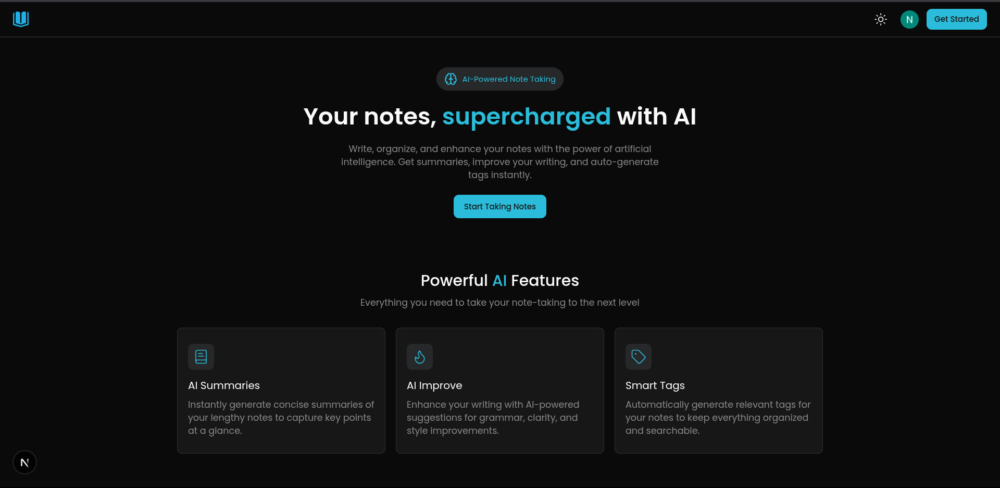
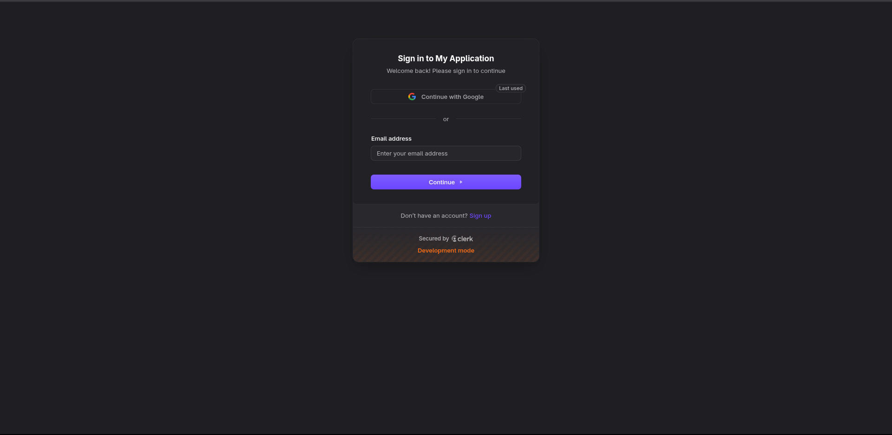
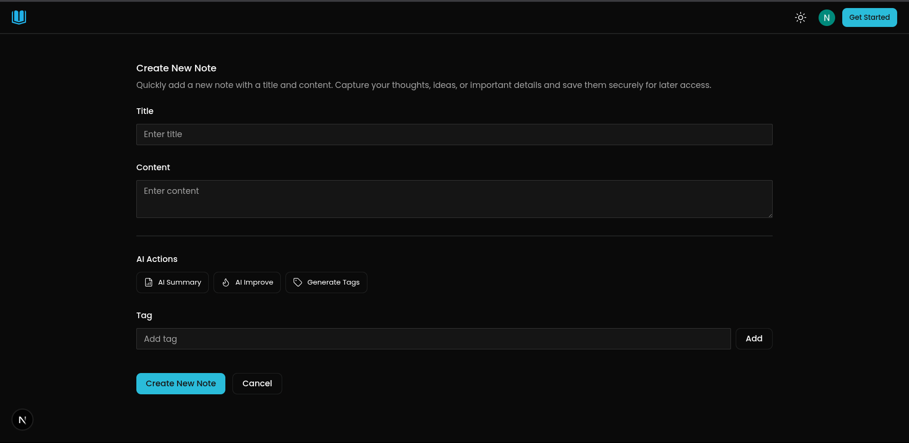
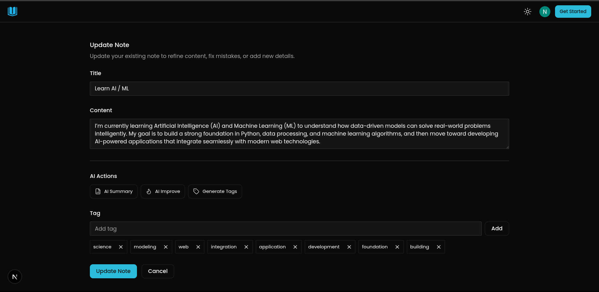
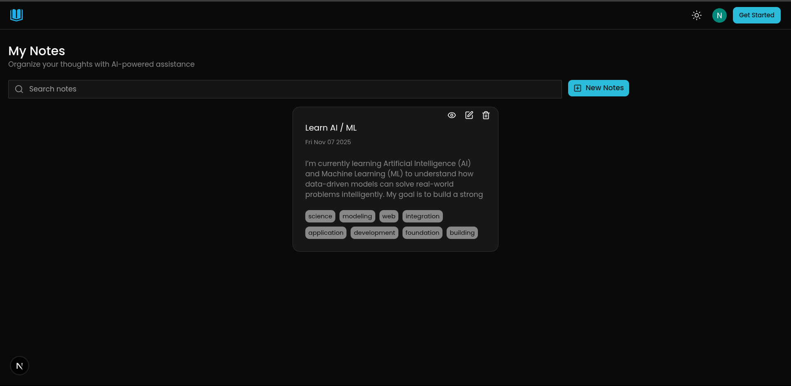

# AI Note Taking App

The AI Note-Taking App is a full-stack application built to simplify digital note-taking with intelligent AI features. It enables users to create, edit, and organize notes while leveraging AI to summarize content, improve grammar, and generate context-aware tags automatically.

---

## Features

1. Users can create and manage their accounts securely.

2. Users can create intelligent notes enhanced by AI features such as:

 - Automatic summary generation

 - Grammar and text improvement

 - Smart tag generation for better organization

3. Users can update existing and remove notes easily.

4. Users can view and manage all saved notes in one place.

5. Users can switch between light and dark themes for a personalized interface experience.

## Technologies

- Frontend : Next js , Tailwind css , Shadcn , Zod(For validation) , Clerk (For authentication), Lucide React(For icons) , React toastify (For toast messages) , Axios (For API calls)

- Backend : Node js , Hono js , MongoDB , Mongoose , Zod(For validation) , Open Router (For AI features) , Dotenv 

- Languages : Typescript

- Vision Control : Git 

## Project View

